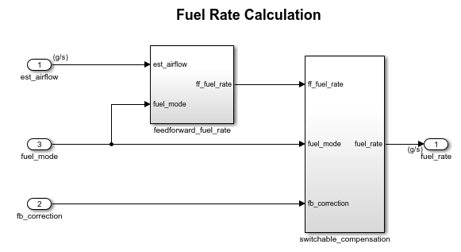

# Outline

- Motivation
    gamification
- Problem definition
(describe why we need this tool and which advantages we will have)
- Related work
(describe the different approaches which have some tutorials like we did in the article?, unity, (extend existing ones))
- Preliminaries
	- EmbeddedMontiArc language
	- EMA Tooling: Emam2Cpp (part which generate tests), Emam2Wasm, SVG generator, OnlineIDE
	- ThreeJS (lightweight cross-browser JavaScript library/API)(how to add new objects)
- Tutorials
(how we can divide this topic?(different tutorials, running example, summary, present some completely, trajectory why we need it))
- Toolchain implementation
	- 3D web-simulator
	- Client-side layer(process files(receive/send), tutorial management, trajectory comp.)
	- Server side (file processing, external modules execution)
	- CoCoChecker(general description what has been done, mention MontiCore)
- Evaluation(?)
	- performance(more math or more components what is working faster?)
- Future work(?)
	- compilation directly in a browser
	- using different tracks
	- standalone tutorial builder
- Conclusion
- References
- Appendix
	- controller for tutorial11

# Motivation
Self-driving vehicles are very important part of our future life. To design and develop this kind of Cyber-physical systems (CPS), Component and connector(C&C) models are widely used. Using C&C models, it is easier to represent different feature layers and their logical interactions. The most important feature of C&C modeling is a possibility to decompose complex models into sub-components and develop and manage, these less complex components, by domain experts.  
To inspire students to be involved in the future technology we invented a web-playground which allows creating controllers for a simulator and almost instantly see the result in 3D environment. We believe that visualization will motivate students and make the studying process more attractive due to gamification. This kind of education become more popular recent years due to good learning outcome(link).  
To teach students how to develop C&C models we should use a C&C modeling language which has all features and tools to satisfy our requirements. EmbeddedMontiArc(EMA)(link) language was picked for this purpose, to achieve the best results in short terms. 

Feature description of chapters(should be done later).

# Problem Definition
not sure that we need it

# 3 Related work
In this section, different tutorials will be analyzed to extract the most convenient and important features. The result will be used to increase the productivity and efficiency of the teaching process. Different tutorials have been taken into consideration from various domains: programming languages, numerical computing environment and so on. The main goal is to find the most useful features and integrate them. 

In the section 3.1 will be introduced very powerful tool which is used in different areas for building systems with any complexity level.

## 3.1 Simulink
Simulink has been created by Mathworks(link). Simulink is a block diagram environment for various domain simulation and Model-Based Design. It also involves C&C models into the modeling process. Users create models in a visual way, not writing the code. You can see an example of a fuel calculation subsystem(see Figure 1). There are depicted the incoming and outgoing ports of the schema, like est_airflow or fuel_rate. And the connections between the components inside. The schema is very useful for visual perception, you can easily see connections between elements and understand the logic behind that. If you had just textual representation of the elements and connections between, it would de much harder to imagine the whole schema and i.e. find some issue with an accidentally connected port or disconnected one.

Simulink has plenty of tutorials in many different areas with detailed description and videos on solving it which describes it step-by-step. It is very helpful to have step-by-step solution with detailed description for understanding all important details. Because on this understanding of essentials, is build the future knowledge and depends future success. But there is some weakness in an education process. The issue is, that they don't have methods for validating the correctness of the user's solution and does not encourage the users to try it out by themselves, just copy the sample solution.

### Rust
Rust is a very popular programming language the prevalence of which is growing every day. It has a consistent tutorial which describes language constructs with gradually increasing complexity. It has the informative and structured index, where users can easily jump from one topic to another almost instantly and then just go back to the place where he was reading before. They use highlighted ares to show some code examples, which facilitate understanding of presented materials.

### Microsoft Z3 Solver
Z3 is a state-of-the art theorem prover from Microsoft. They provide similar experience compare to Rust tutorial but have some improvements, which actually simplify the studying process. We meant the possibility to execute the code from the current tutorial directly in the browser and see the result almost instantly due to in-browser execution. It helps to see the direct binding between written commands and the real result, that improves understanding of given material.

### Octave Online 
Octave Online is web-playground fot a high-level language Octave, which is primarily intended for numerical computations. It has a simple and intuitive interface despite the complexity of the internal implementation. It provides directly in a browser fast execution with errors handling. Even if you do complex computations it is not needed to install any software on the PC. Everything works out of the box.

### Wolfram Alpha
Wolfram Alpha is a very powerful tool, which works by using expert-level knowledge and algorithms to automatically answer questions, do analysis and generate reports. It has nice matrix operations and calculations as the EmbeddedMontiArcMath language has, to describe atomic components. It can do even more as solving linear equations, it allows to specify the behavior of controllers, and then by solving the equations they synthesize the controller. Furthermore, it has one very interesting and useful feature, which provide the interactive visualization of the given data. The idea behind that is that you can "feel" how one or another parameter influence on the final result. It promises a better understanding of the dependencies between the components or elements of the system.

### TypeScript Playground
TypeScript is a typed superset of JavaScript. It has a clean and simple playground which shows the difference and benefits of TypeScript over JavaScript. It has preloaded examples which actually show this difference and a user can see distinction in the direct comparison. What, again, gives the better understanding and facilitates further analysis(R7).

### Swift Playgrounds
Swift Playgrounds has been created for teaching the Swift language in a game form. You can create small programs that instantly show the results of the code that you write. From the right side of the screen is shown a 3D world where an action is happen. The tutorials are pretty simple but the concept is very interesting. They have automatic verification of the correctness of an implemented solution in the 3D environment. To produce many diverse game oriented tutorials, it would be convenient to have simple 3D models importing which can use different models from various 3D editors.

### Unity
TODO: add description

Thoroughly analyzed the projects described above, we have derived the following list of requirements for our tool:

(R1) 3D visualization for demonstration purposes  
(R2) Simple, clean and intuitive interface  
(R3) Work on any operating system and without installation  
(R4) Automatic verification of obtained results  
(R5) Import and use existing 3D models for the simulation
(R6) Displaying the object's trajectory
(R7) Integrated testing support

The table summarizes the comparison between the all considered tutorials.
(+ support, P partially support)

|    | Z3 Solver | Octave online | Wolfram Alpha | TypeScript PG | Swift PG | Rust | Simulink | EMAM PG |
|:--:|:---------:|:-------------:|:-------------:|:-------------:|:--------:|:----:|:--------:|:-------:|
| R1 |     -     |       +       |       +       |       -       |     +    |   -  |     +    |    +    |
| R2 |     +     |       +       |       +       |       +       |     +    |   +  |     +    |    +    |
| R3 |     +     |       +       |       +       |       +       |     -    |   +  |     -    |    +    |
| R4 |     -     |       -       |       -       |       -       |     +    |   -  |     +    |    +    |
| R5 |     -     |       -       |       -       |       -       |     -    |   -  |     +    |    +    |
| R6 |     -     |       -       |       P       |       -       |     P    |   -  |     P    |    +    |
| R7 |     -     |       -       |       -       |       -       |     -    |   -  |     +    |    +    |

Let us take a closer look at the difference between the tutorials regarding to the derived requirements.  
**(R1) 3D visualization for demonstration purposes:** Four considered tutorials have a 3D visualization. The Octave online has a possibility to generate plots and graphics for given data. The Wolfram Alpha has a very powerful tool which can generate 3D models and you can even interact with them and see the changes in a real time. Whereas the Swift Playground has the most advanced 3D world which is like a part of the tutorial and result presentation. The Simulink has an opportunity to build nice 3D models which involved in the simulation process, but the difference is that a user has to build everything himself.   
**(R2) Simple, clean and intuitive interface:** This is the only requirement which all tutorial are satisfied. We believe that it is very important to have an understandable and clear interface which does not distract from the educational process.  
**(R3) Work on any operating system and without installation:** Almost all examined tutorials have web-implementation and work without installation, except the Swift tutorial and Simulink. The Swift tutorial has only iOS realization. The Simulink does not work on the Web too, only the MathLab, which has partial web-implementation.  
**(R4) Automatic verification of obtained results:** Only one among the examined tutorials, the Swift tutorial, has a gaming base verification of a solution correctness. It causes additional interest in the studying process, and can be the motivation to keep solving the tasks, by analogy with computer games. Whereas the Simulink gives you possibility to do it, but it is more like feature which can be implemented.
**(R5) Import and use existing 3D models for the simulation:** Only the Simulink has feasibility to import 3D models. It helps to create tutorials quickly and efficiently, by using the previously created models and configurations. An example of reusing a 3D object can be a cone that is used in many exercises. This feature, in our opinion, simplifies the process of creating new tutorials and decrease the time which has to be invested in the creation process.  
**(R6) Displaying the object's trajectory:** Wolfram Alpha, Swift PG and Simulink, we could say, partially support this feature in case that you can see the whole process of movement of the object from the very beginning to the end. But we decided to improve the concept and add the separate window which permanently displays a traversed route of the object, for better visual perception and visual comparison of results. In our case the object is a car.  
**(R7) Integrated testing support:** Only the Simulink has integrated testing options. Due to the specificity of our tutorial, the tests, for us, play an important role. Writing the streaming test for a component we can be sure that it reacts properly to the incoming data. Tests make the components more reliable and robust. Because of the using the C&C language, it is great to be sure that each component of a composed model behaves correctly.  
Taking into account all these derived requirements we going to start working on the architecture.