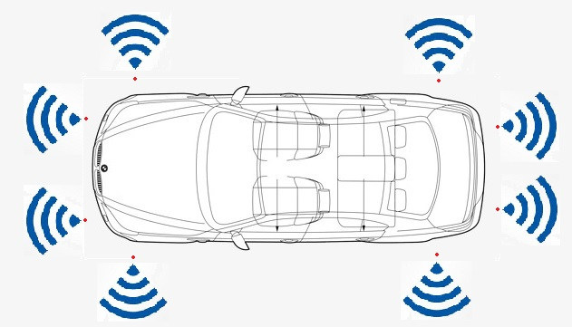
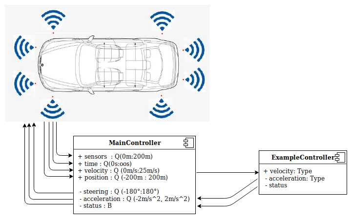

# Beginner's Tutorial

##### Accelerate to the given speed.
Implement the model that continuously accelerates to 10 m/s and then stops.
    
##### Basic explonation:
The car has 8 sensors to measure distances to obstacles. They are located respectively: 



To solve this task it's needed to use only acceleration of the car. Changing the acceleration you may control the behavior of the car. To be able to reach 10 m/s speed, you have to accelerate the car continuously until it reaches the desired speed. Let's start with a MainController which defines the interface to the simulator. We should create a new file which has the same name like component has with .emam extension.

```
package controller;                         // The name of the folder where all .emam files are located.

component MainController{
    ports                                   
        in Q(-200m:200m) frontLeftSensor,       //front left sensor with range from 0 meters to 200 meters
        in Q(-200m:200m) frontRightSensor,      //front right sensor
        in Q(-200m:200m) frontLeftSideSensor,   //side left front sensor
        in Q(-200m:200m) frontRightSideSensor,  //side left back sensor
        in Q(-200m:200m) backLeftSideSensor,    //side right front sensor
        in Q(-200m:200m) backRightSideSensor,   //side right back sensor
        in Q(-200m:200m) backLeftSensor,        //back left sensor
        in Q(-200m:200m) backRightSensor,       //back right sensor

        in Q(0s:oos) time,                      //simulation time from 0s to infinity
        in Q(0m/s:25m/s) velocity,              //car velocity
        in Q(-200m:200m) xPosition,             //car position X
        in Q(-200m:200m) yPosition,             //car position Y

        out Q(-2m/s^2:2m/s^2) acceleration,     //car acceleration 
        out Q(-180°:180°) steering,             //car steering
        out B status;                           //whether the simulation is still running
```
After examination of the example, we should notice:
- Component has ports incoming and outgoing
- For each port must be specified a type (Q is Double or B is Boolean) with a valid range.
- After each port name has to be a comma and the last one must have a semicolon.
- The possible units are:
    - Distance: meters(m), kilometers(km)
    - Time: seconds(s), minutes(m), hours(h)
    - Velocity: km/h, m/s
    - Acceleration: m/s^2
    - Rotation: degrees(°)

It was the default interface for the Simulator. It has to be define for all possible controllers. Then you may create your own components which will be connected to the mainController. Let's create a simple component and connect it to the main one. To do that, we have to create new file with following content:

```
package controller;

component ExampleController {
	port
		in Q(0m/s:25m/s) velocity,          //incoming port velocity with given range
		out Q(-2m/s^2:2m/s^2) acceleration, //outgoing port which controls the acceleration of the car
		out B status;                       //outgoing port which stops the simulation process

	implementation Math{
		
		if (velocity <= 10 m/s)
    	    acceleration = 0.5 m/s^2;       //until the car reaches 10 m/s accelerate with 0.5 m/s^2
            status = false;
    	else
    		status = true;                  //When reach the velocity 10 m/s -> stop the simulation
        end
	}
}
```

There is one incoming port and two outgoing. Firstly we should reach the speed 10 m/s then stop the simulation. The logic of the controller is implemented inside the Math{}. Inside the Math{} scope you can see __if-else-end__ constructions and the example how to use it.
When we have created the ExampleController we should import it into the MainController and then instantiate it:

```
package controller;

import ExampleController; // here has being imported the actual controller

component MainController{ 
...


instance ExampleController exampleController;

```
Now is time to connect the controller to the MainController.

```
    connect velocity->exampleController.velocity;
    connect exampleController.acceleration->acceleration;
    connect exampleController.status->status;
}
```

Here we have connected the incoming port - velocity(mainController) to our instantiated controller and its corresponding incoming port velocity. Then we connect the outgoing port of velocityController.acceleration to the outgoing port of our MainController. And finally the status port of the ExampleController to status of the MainController.

Finally the connections scheme should look like that:



Eventually we should send these files to the server to process it and then execute in the simulator.

For better understanding the syntax of the EmbeddedMontiArc and get some ideas how to define modules of a controller it's a good idea to read the documentation here (https://github.com/EmbeddedMontiArc/Documentation#embeddedmontiarc-yannick).
