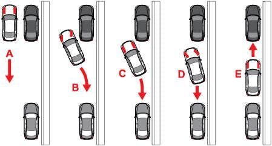

# Tutorial(03)

### Carry out a parallel parking between two cars.
Implement a model that manages a parking between two cars. The model needs to have several modules which are responsible for different actions, for instance:
1. Module controlling the speed of the vehicle depending on the current action (e.g. parking, searching a parking place).
3. Module looking for a parking gap between vehicles.
2. Module controlling the steering of the vehicle during the parking process.

Each module should be as simple as possible.

To solve this tutorial you have to use at least 6 sensors measuring the distance to objects located on the front/rear/left/right side of the vehicle. The speed has to be around 0.5-1 m/s. In the picture you can see the main idea of the parking procedure:

The parking process can be subdivided into 4 steps:  
1. Go straight until a slot have been found.
2. When the slot is found, go back and rotate the car.
3. When the vehicle has reached an appropriate position, rotate it towards the other direction to fit it into the parking slot.
4. When the car is close to the car behind, stop and go forward until it reaches a certain distance to the front car.

**It is important to know that this web-simulator is a simplified version and does not simulate the angle of the front wheels but only the actual car yaw.**

Show the [solution](solutions/solution03.md).