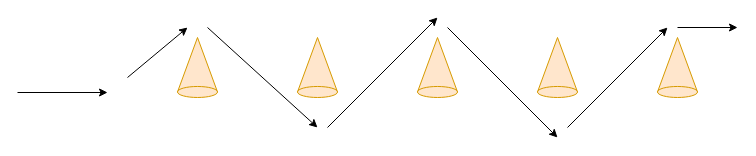

# Tutorial(04)

### Maneuverability test - drive between cones.
Implement a model that manages driving between cones, which emulates the maneuverability test. The model has to have several modules which are responsible for different actions, for instance:
1. Module controlling the speed of the car
2. Module responsible for the steering angle of the car depending on the current position.

Each module should be as simple as possible.

To solve this tutorial you may use 4 to 6 sensors, measuring the distance to objects located in front/rear/left/right side of the vehicle. The speed has to be around 1-2 m/s. In the picture you can see the main idea of the maneuver:

The parking process can be subdivided into several steps:  
1. Go straight until a cone is closer than 10m. Then start turning the car around the cone.
2. When the front part of the car has passed the cone, start turning towards the opposite direction.
3. When the car is rotated enough to pass the next cone, stop turning and continue moving straight.
4. Repeat the second step until you have passed all cones.

**It is important to know that this web-simulator is a simplified version and does not simulate the angle of the front wheels but only the actual car yaw.**

Hint: In this task it will be helpful to use static variables like counters.

Show the [solution](solutions/solution04.md).