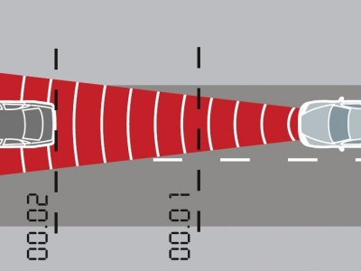

# Tutorial(06)

### Follow the car (adaptive cruise control).
Implement a model which follow a car in front. The car in front starts movement and your car has to catch up the car in front and then follow it with the similar velocity. It should be something like adaptive cruise control for cars. At the picture you can see how the measurements are done:

The model has to have several modules which are responsible for different actions, like we always do. One of the examples could be:
1. Module which controls the velocity of the car (acceleration and braking)
2. Module which measures the distance to a car in front.
3. Module that in charge of start/end the simulation.

To solve this tutorial you need only 2 sensors, which measure the distance to objects which are located in front of the car. You can define the maximum velocity around 2 m/s.

The process can be divided in several steps:
1. Start moving and reach the max speed until there is no car in front.
2. Caught up the car in front and start braking to match the velocities.
3. Start following the car with the similar speed.
4. Adjust the velocity if it is needed.

This task is a preparatory stage for the next tutorials.

Show the [solution](solutions/solution06.md).