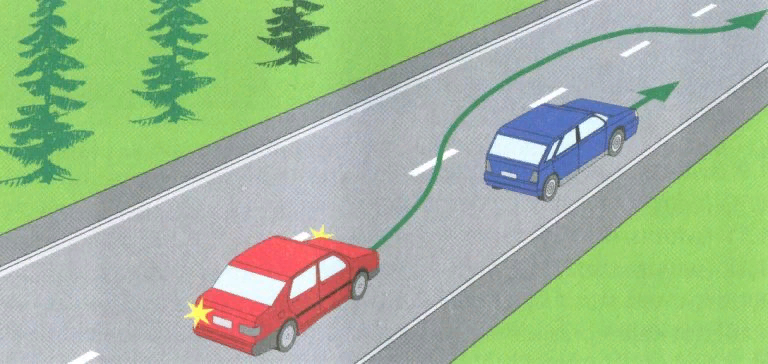

# Tutorial(07)

### Overtaking a car on a straight road
In this tutorial we are going to implement a model which is in charge of an overtaking process. We intend to use the previously created controller from the tutorial06. Now it is needed to catch up a front driving car and then ,if we have enough space for overtaking, carry out the maneuver.

The part of modules of the tutorial can be borrowed from the previous one:
1. Module which controls the velocity of the car (acceleration and braking).
2. Module which measures the distance to a car in front.
3. Module that in charge of start/end the simulation and additionally denotes that we can start overtaking process.
Then we have to add new ones to be able accomplish the task. It could be following:
4. Module that proceeds the overtaking.
5. Module which indicate that the car already passed another car.

To solve this tutorial you need only almost all sensors around the car. You can define the maximum velocity around 2 m/s.

The overtaking process can be divided in following steps:
1. Start moving and reach the max speed until there is no car in front.
2. Caught up the car in front and start braking to match the velocities.
3. Start following the car with the similar speed.
4. On certain point start an overtaking process, turn left to shift the car relatively another car in front.
5. Increase the velocity to overtake the car.
6. After passing the front car, turn right a bit to align the car.
7. Align the rotation of the car with the track.

Show the [solution](solutions/solution07.md).