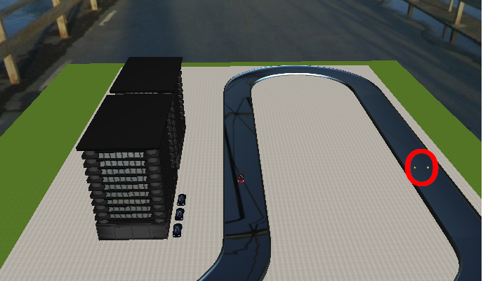

# Tutorial (10)

### React on an obstacle on the track.

In this tutorial we are going to extend a functionality of the previously created controller, which helps to drive the track. The car must stop if there is an obstacle on the track, in front of the car, and if it is gone, continue moving. We should add the functionality which helps to brake before an obstacle and detect the obstacle. We may reuse here the following controllers:

1. The controller which checks the boundaries of the track
2. The controller which in charge of the velocity control.
3. And the last one, that controls the steering of the car.

We may modify the velocity controller to have a brake function and then add another controller which will detect the obstacle on the track. It should be enough to have just four controllers. It is sufficient to use for this purposes just two sensors. The obstacle will be located in the following place :

 

An approximate position of the obstacle is (-8:100 or z24). The car should reach the obstacle and stop, when it disappears(100 seconds after simulation has started) the car must continue the movement.

Show the [solution](solutions/solution10.md).