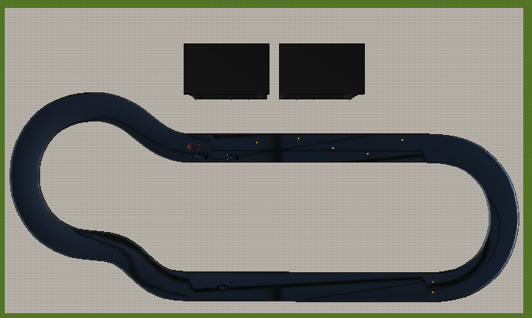

# Tutorial (11)

### Run full circle

In this tutorial we are going to use all previously created controllers to run the track with different obstacles and actions.

We can divide the track into several zones, where different actions are going to happen:
1. First one will be the curved area where we have to drive using our previously created controller for running the whole track with optimal trajectory.
2. Then on the straight part of the track a car waiting for us to start movement, give us possibility firstly to use the follow controller and then the overtaking one.
3. After overtaking at the end of the strait part of the track, the obstacle form the cones is waiting for the car. The car should brake before the obstacle and then continue the movement when the obstacle is gone.
4. At the curve part of the track we have to use again the controller which we used in the first part, just drive through the track.
5. Next test will be running across the field of cones.
6. The last one will be the parallel parking. We should use here the controller which measure the gap between the cars.

All these controllers were created before in the first ten tutorials and here we have to combine all them in one controller which can manage all these actions. Previously we have done some tutorials which use several controllers simultaneously. The main idea that we have an actions controller, which manages actions. This tutorial has to be done in the similar way.

Show the [solution](solutions/solution11.md).